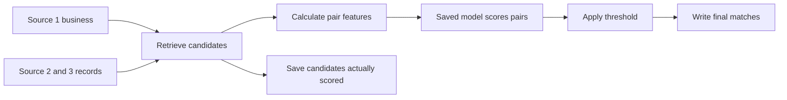

# Team Guide — Start Here

We are building a business-matching program for the Amazon ML Challenge. This guide assumes no previous machine-learning experience.

**Project status:** Passes 1–4 now cover reliable data loading, audited experiment IDs, the official scorer, a complete synthetic model pipeline, and measured real-data retrieval against all training targets. There are 190 passing regression cases. Real classifier accuracy and complete competition outputs remain future work. Start with [brain.md](../brain.md), the [Pass 4 inspection walkthrough](pass4_walkthrough.md), and the [README](../README.md). The [Pass 3 walkthrough](pass3_walkthrough.md) explains the smaller complete model flow.

## Read in this order

1. This guide: the problem, tools, and competition outputs.
2. [Dataset findings](dataset_insights.md): measured facts, real examples, and the `NA` correction.
3. [Implementation plan](../implementation_plan.md): small passes and their completion checkpoints.
4. [Testing plan](testing_plan.md): how we will catch bugs and distinguish software tests from model evaluation.

The supplied [challenge README](<../Data Set ML Challenge/student_resource/README.md>) is the reference for competition requirements. Our documents explain it; they do not replace it.

## What problem are we solving?

There are three lists of business records. Source 1 is the reference list. For each Source 1 business, find every record in Sources 2 and 3 that refers to the same business.

The same business can have different spellings, abbreviations, scripts, and address formats. Different businesses can also share similar names or an address. A business can have zero, one, or multiple matches.

Each record contains an ID, business name, address, and country. IDs identify records; matching businesses across sources do not share the same ID.

This task is called **entity resolution**. Here, an entity is a business. We are not predicting prices or creating new business information.

## Words we will use

| Term | Meaning in this project |
|---|---|
| TSV | A text table with tabs between columns; commas can still occur inside an address or target-ID list |
| Ground truth | The supplied answer key listing correct training matches |
| Candidate | A target record selected for closer examination; it is not yet an accepted match |
| Blocking/retrieval | Finding a manageable candidate list instead of comparing every possible pair |
| Pair | One Source 1 record and one potential matching Source 2/3 record |
| Feature | A numerical clue about a pair, such as address similarity |
| Label | The known answer for a training pair: match or no match |
| Model/training | A program that learns relationships between features and labels |
| Inference | Using the trained model to score new pairs |
| Threshold | The cutoff at or above which a model score is accepted as a match |
| Singleton | A Source 1 business with no true matches in the other sources |
| Fixture/regression test | A small known input, and an automated check that an important behavior keeps working |

## Tools and their jobs

| Tool | Job | Important limit |
|---|---|---|
| Python | Runs and connects the workflow | We still need clear interfaces and explicit settings |
| Pandas | Reads and processes tables, including chunks and the current split | Default parsing can change literal `NA` to missing; reading a whole file can use too much RAM |
| NumPy | Efficient arrays of numerical features and labels | Faster arrays do not make trillions of comparisons practical |
| scikit-learn | TF-IDF text representation for candidate retrieval; the old demo also uses nearest-neighbor search | Similar-looking names are not guaranteed to be the same business |
| SQLite / FTS5 | Stores the full target pool on disk and retrieves candidates through exact fields and indexed words | Word overlap cannot translate names or recognize every typo; shortlist recall must be measured |
| RapidFuzz | Calculates text-similarity features | A character-similarity score does not understand business identity or translate scripts |
| LightGBM | Learns from numerical features using many decision trees | It cannot accept a true match that retrieval never gives it |
| `venv` / Git | Isolate Python dependencies / track project changes | Large datasets and generated artifacts should be kept out of normal source commits |
| `pytest` | Runs our automated software tests | Passing tests does not prove matching accuracy |

The tools work together. Which stage costs the most depends on the retrieval method, candidate count, and available hardware; no single library automatically solves the whole problem.

## Training and prediction are different activities

During **training**, we retrieve pairs for training businesses, calculate features, attach known labels, and let LightGBM learn. We save the resulting model and its settings.

During **prediction**, we retrieve candidates, calculate the same features, apply the saved model, accept pairs at or above the chosen threshold, and write the results. We do not have test answers to guide these decisions.

Before the real test data, we perform the same prediction process on held-out training businesses whose answers we know. That lets us measure accuracy honestly.

## How do we know it is working?

**Precision:** Of the matches we predicted, how many were correct? **Recall:** Of the true matches, how many did we find? Predicting too many pairs can reduce precision; predicting too few can reduce recall.

The competition uses **F0.5**, a score that combines both and emphasizes precision. It scores each Source 1 business separately, then averages across all businesses. A correct empty prediction for a singleton scores 1; predicting any match for that singleton scores 0.

We separate labeled businesses into three roles:

- **Training:** the model learns from these businesses.
- **Development:** we choose retrieval rules, features, and thresholds using these businesses.
- **Evaluation:** we freeze settings, then measure on businesses we did not use to make those choices.

The competition **test** data is a fourth role: it has no public answer key. Running it successfully establishes execution, not accuracy.

Pass 2 preserved 1,986,139 training businesses and divided the old validation data into 110,340 development and 110,342 reserved evaluation businesses. Smaller fixed samples contain 5,000/1,000/1,000 businesses. The files under `artifacts/evaluation/pass2_v1/` select Source 1 queries only; the full training Source 2/3 pool remains available for retrieval. Their seed and file hashes let teammates reproduce the same experiment. See the [Pass 2 record](pass2_verification.md).

Software tests answer a different question: whether the program follows its defined rules. For example, preserving `NA`, calculating F0.5 correctly, and writing an empty row are testable even before we have a useful model.

## What do we upload?

| Stage | Required material |
|---|---|
| Leaderboard portal | Only `matching_results.tsv`, containing predictions for every test Source 1 ID |
| Separate final ZIP | Both prediction/candidate files, runnable code, pinned dependencies, reproduction instructions, and the completed methodology document |

For `matching_results.tsv`, the exact columns are `source1_entity_id` and `matched_entity_ids`, separated by a tab. List target IDs with commas. Leave the second field empty for no matches, retaining the separating tab.

For `candidate_pairs.tsv`, the exact columns are `source1_entity_id` and `candidate_entity_ids`. Save the last candidate set actually passed to model inference, after any retrieval filters. Every final match must appear in that entity's candidates.

The final competition files need exactly **1,732,544 data rows**, one per real test Source 1 ID, plus their header. The Pass 3 fixture files instead have 8 invented Source 1 rows each; they are local learning examples and must not be uploaded. IDs inside each list must be unique and refer to existing test Source 2/3 records. Country, including France, never excuses a missing row.

Run the supplied validator before uploading. Its default run does not check whether every target ID exists, and some candidate inconsistencies only produce warnings. Our own checks must cover these too. A validator `PASS` says nothing about prediction accuracy. The supplied README describes a `SCORED` portal status for correctly evaluated submissions; leaderboard refresh timing is controlled by the portal.

The final package layout and model constraints are in the supplied README. The challenge prohibits external business identity lookup and external data augmentation; our matching work uses the provided data.

## How we will work as a team

For each pass, explain the intended change, implement a small piece, run the relevant checks, inspect an example, and record the evidence. Keep observed facts separate from possible explanations.

For example: “the file contains `NA`” is an observation. “`NA` can be an abbreviation here” is supported by labeled counterparts such as “National Alliance Inc.” “Every `NA` means not available” is unsupported and would cause information loss.

Our immediate activity is reviewing the [Pass 4 retrieval comparison](pass4_verification.md) and missed links. Pass 2's hand-written predictions score 2/3 to verify arithmetic; Pass 3's invented model run scores 0.875 to demonstrate the connected workflow. Pass 4 measures real candidate recall on development businesses. These measurements answer different questions, and none is the final real classifier score. Pass 5 will connect realistic training pairs and model evaluation; it has not started.
